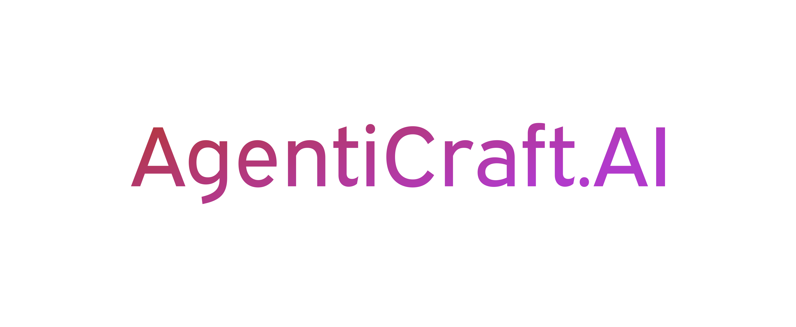

# AgentiCraft

<div align="center">
  
  
  **Build AI agents as simple as writing Python**

  
  [](https://www.python.org/downloads/)
  [](https://github.com/agenticraft/agenticraft/blob/main/LICENSE)
  [](https://github.com/agenticraft/agenticraft/actions)
  [](https://agenticraft.github.io/agenticraft/)
  
  [Documentation](https://github.com/agenticraft/agenticraft/tree/main/docs) | [Examples](examples/) | [Discussions](https://github.com/agenticraft/agenticraft/discussions) | [Issues](https://github.com/agenticraft/agenticraft/issues)
</div>

## 📌 Project Status

**Current Version**: v0.1.1 (Beta)  
**Status**: Active Development  
**Released**: June 2025  
**PyPI**: `pip install agenticraft` 🎉  

This is the initial public release. We're actively working on additional features and welcome community feedback!

## 🎯 Why AgentiCraft?

## ✨ New in v0.1.1

- 🔄 **Dynamic Provider Switching** - Switch LLM providers on the fly
- 🧠 **ReasoningAgent** - Built-in agent for transparent step-by-step reasoning
- 🔧 **WorkflowAgent** - Specialized agent for complex multi-step workflows
- 🤖 **3 LLM Providers** - OpenAI, Anthropic (Claude), and Ollama (local models)
- 📊 **95%+ Test Coverage** - Production-ready with 691+ tests

Building AI agents should be as simple as writing Python. We focus on intuitive design and clear abstractions that scale with your needs.

**AgentiCraft** is a production-ready AI agent framework that prioritizes:

- 🚀 **5-minute quickstart** - Build your first agent faster than making coffee
- 🧠 **Transparent reasoning** - See how your agents think, not just what they output
- 🔌 **MCP-native** - First-class Model Context Protocol support
- 📊 **Built-in observability** - OpenTelemetry integration from day one
- 🎯 **Production templates** - Deploy to production, not just demos
- 🔧 **Intuitive abstractions** - Complex capabilities through simple, composable interfaces

## 🚀 5-Minute Quickstart

### Installation

```bash
# Install from PyPI (recommended)
pip install agenticraft

# Install with specific provider support
pip install "agenticraft[openai]"     # OpenAI GPT models
pip install "agenticraft[anthropic]"  # Anthropic Claude models
pip install "agenticraft[all]"        # All providers```

## 🤝 Contributing

We believe in quality over quantity. Every line of code matters.

```bash
# Clone the repository
git clone https://github.com/agenticraft/agenticraft.git
cd agenticraft

# Install in development mode
pip install -e ".[dev]"

# Run tests
pytest

# Run linting
ruff check .
black .

# Build documentation
mkdocs serve -f mkdocs-simple.yml
```

See [CONTRIBUTING.md](CONTRIBUTING.md) for detailed guidelines.

## 🗺️ Roadmap

### v0.1.0 (June 4, 2025)
- ✅ Core framework (<2000 LOC)
- ✅ Base Agent with reasoning patterns
- ✅ Tool system with decorators
- ✅ MCP protocol support
- ✅ Simple workflow engine
- ✅ Conversation + Knowledge memory
- ✅ OpenTelemetry integration
- ✅ CLI tool
- ✅ Production templates

### v0.1.1 (Current Release - June 6, 2025)
- ✅ Complete Anthropic provider (Claude 3 support)
- ✅ Complete Ollama provider (local models)
- ✅ Provider factory with smart model detection
- ✅ 90+ provider tests with >95% coverage
- ⏳ PyPI package release (in progress)
- ⏳ Documentation website (deployment pending)

### v0.2.0
- [ ] Streaming responses
- [ ] Advanced reasoning patterns
- [ ] Tool marketplace
- [ ] More MCP integrations
- [ ] Performance optimizations

### v1.0.0
- [ ] Stable API guarantee
- [ ] Enterprise features
- [ ] Cloud deployment helpers
- [ ] GUI for agent building

## 🤔 Philosophy

1. **Simplicity First** - If it's not simple, it's not in core
2. **Transparency Default** - Show reasoning, not magic
3. **Production Ready** - Built for deployment, not demos
4. **Developer Joy** - APIs that spark creativity
5. **Documentation Driven** - If it's not documented, it doesn't exist

## 🤝 Getting Help

- 📖 Check the [documentation](docs/)
- 💬 Ask in [GitHub Discussions](https://github.com/agenticraft/agenticraft/discussions)
- 🐛 Report bugs in [GitHub Issues](https://github.com/agenticraft/agenticraft/issues)
- ⭐ Star the repo to show support!

## 📝 License

Apache 2.0 License - see [LICENSE](LICENSE) file for details.

## 🙏 Acknowledgments

Built with inspiration from the AI agent community and a desire to make agent development accessible to everyone.

Special thanks to all contributors and early testers who helped shape AgentiCraft.

---

<div align="center">
  <strong>Ready to build?</strong>
  
  ```bash
  pip install git+https://github.com/agenticraft/agenticraft.git
  ```
  
  **Build your first agent in 5 minutes.**
  
  [Get Started](docs/quickstart.md) | [Join Discussion](https://github.com/agenticraft/agenticraft/discussions) | [Star on GitHub](https://github.com/agenticraft/agenticraft)
</div>
